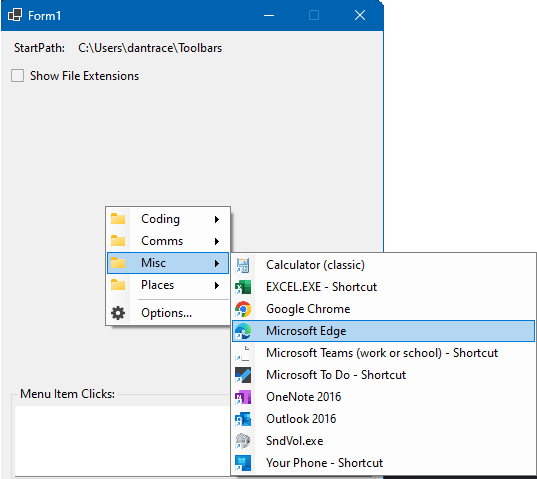

## Class FileBrowserContextMenuStrip

Windows Forms ContextMenuStrip for cascading browsing of folders and files.



```csharp
public class FileBrowserContextMenuStrip : ContextMenuStrip
```
### Constructors

```csharp
public FileBrowserContextMenuStrip()
```

```csharp
public FileBrowserContextMenuStrip(IContainer? components)
// components: container for disposing.

```
##### Parameters

`components` [IContainer](https://learn.microsoft.com/dotnet/api/system.componentmodel.icontainer)?

Form components for disposing.

### Properties
```csharp
 // Menu items to show after the "Options" menu item.
 // Add menu items into AfterOptions to add custom menu item controls.
 public ICollection<ToolStripItem> AfterOptions { get; }
```
```csharp
 // Title for the options dialog
 public string OptionsFormTitle { get; set; }
```
```csharp
// Persistence identifier to make multiple instances unique.
public string PersistenceId { get; set; }
```
```csharp
// If true, show file extensions in the menu items.
[Bindable(true)]
public bool ShowFileExtensions { get; set; }
```
```csharp
// If true, Show Shell Menu on right-click
// Shell menu provides an explorer-like menu for file actions such as copy/paste etc.
[Bindable(true)]
public bool ShowShellMenu  { get; set; }
```
```csharp
// Path to start browsing from.
[Bindable(true)]
public string? StartPath { get; set; }
```
### Events
```csharp
// Raised when the user clicks on a file MenuItem.
public event EventHandler<FileInfo>? FileMenuItemClicked
```
```csharp
public event PropertyChangedEventHandler? PropertyChanged
```

