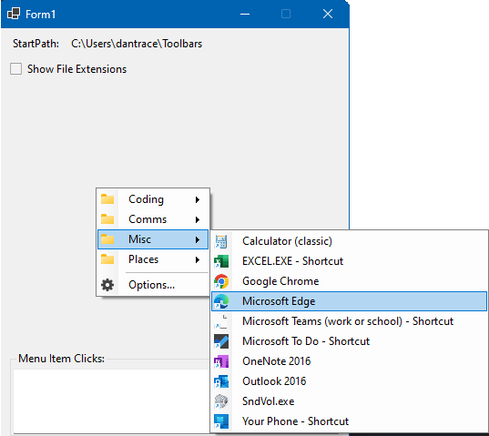

## <a id="giuaC_FileBrowserContextMenu_FileBrowserContextMenuStrip"></a> Class FileBrowserContextMenuStrip

Namespace: [giuaC.FileBrowserContextMenu](giuaC.FileBrowserContextMenu.md)  
Assembly: FileBrowserContextMenu.dll  

Windows Forms ContextMenuStrip for cascading browsing of folders and files.



```csharp
public class FileBrowserContextMenuStrip : ContextMenuStrip
```

##### Inheritance

[object](https://learn.microsoft.com/dotnet/api/system.object) ← 
[MarshalByRefObject](https://learn.microsoft.com/dotnet/api/system.marshalbyrefobject) ← 
[Component](https://learn.microsoft.com/dotnet/api/system.componentmodel.component) ← 
[Control](https://learn.microsoft.com/dotnet/api/system.windows.forms.control) ← 
[ScrollableControl](https://learn.microsoft.com/dotnet/api/system.windows.forms.scrollablecontrol) ← 
[ToolStrip](https://learn.microsoft.com/dotnet/api/system.windows.forms.toolstrip) ← 
[ToolStripDropDown](https://learn.microsoft.com/dotnet/api/system.windows.forms.toolstripdropdown) ← 
[ToolStripDropDownMenu](https://learn.microsoft.com/dotnet/api/system.windows.forms.toolstripdropdownmenu) ← 
[ContextMenuStrip](https://learn.microsoft.com/dotnet/api/system.windows.forms.contextmenustrip) ← 
[FileBrowserContextMenuStrip](giuaC.FileBrowserContextMenu.FileBrowserContextMenuStrip.md)

### Constructors

#### <a id="giuaC_FileBrowserContextMenu_FileBrowserContextMenuStrip__ctor"></a> FileBrowserContextMenuStrip\(\)
```csharp
public FileBrowserContextMenuStrip()
```

#### <a id="giuaC_FileBrowserContextMenu_FileBrowserContextMenuStrip__ctor_System_ComponentModel_IContainer_"></a> FileBrowserContextMenuStrip\(IContainer?\)
```csharp
public FileBrowserContextMenuStrip(IContainer? components)
```

##### Parameters

`components` [IContainer](https://learn.microsoft.com/dotnet/api/system.componentmodel.icontainer)?

Form components for disposing.

### Properties

#### <a id="giuaC_FileBrowserContextMenu_FileBrowserContextMenuStrip_OptionsFormTitle"></a> OptionsFormTitle

Title for the options dialog

```csharp
public string OptionsFormTitle { get; set; }
```

#### <a id="giuaC_FileBrowserContextMenu_FileBrowserContextMenuStrip_PersistenceId"></a> PersistenceId

Persistence identifier to make multiple instances unique.

```csharp
public string PersistenceId { get; set; }
```

#### <a id="giuaC_FileBrowserContextMenu_FileBrowserContextMenuStrip_ShowFileExtensions"></a> ShowFileExtensions

If true, show file extensions in the menu items.

```csharp
[Bindable(true)]
public bool ShowFileExtensions { get; set; }
```

#### <a id="giuaC_FileBrowserContextMenu_FileBrowserContextMenuStrip_StartPath"></a> StartPath

Path to start browsing from.

```csharp
[Bindable(true)]
public string? StartPath { get; set; }
```

#### <a id="giuaC_FileBrowserContextMenu_FileBrowserContextMenuStrip_FileMenuItemClicked"></a> FileMenuItemClicked

Raised when the user clicks on a file menuitem.

```csharp
public event EventHandler<FileInfo>? FileMenuItemClicked
```

### Events

#### <a id="giuaC_FileBrowserContextMenu_FileBrowserContextMenuStrip_PropertyChanged"></a> PropertyChanged

Raised when a property changes.

```csharp
public event PropertyChangedEventHandler? PropertyChanged
```

